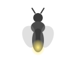

# FireflyChat

A modern AI chat desktop application built with PyWebView, React, and Material-UI. Features OpenAI's GPT integration, UV for Python package management, and a TypeScript frontend with MUI components for a polished user interface.

## Requirements

- Python 3.12+
- Node.js 16+
- UV (Python package manager)
- OpenAI API key